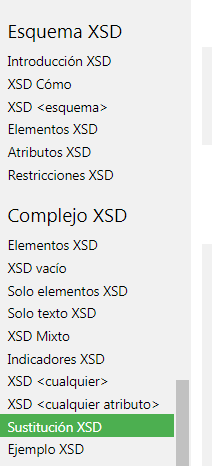
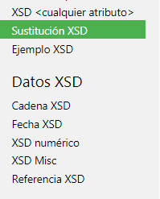

# __Repaso temas XSD__

De manera general lo que estuve revisando el dia de hoy fueron temas de XSD:

* restricciones
```
    <xs:element name="edad">
        <xs:simpleType>
            <xs:restriction base="xs:integer">
                <xs:minInclusive value="0"/>
                <xs:maxInclusive value="60"/>
            </xs:restriction>
        </xs:simpleType>
    </xs:element>
```
El elemento __edad__ debe ser de tipo entero y no puede ser mayor a 60 y menor que 0.

* atributos
```
    <xs:attribute name="edad" type="xs:string"/>

    <persona age="edad">Joe</persona>

```
El ejemplo muestra un atributo de nombre edad, enseguida se aplica el atributo al elemento persona

* sustitucion de elementos
```
    <xs:element name="nombre_1" type="xs:string"/>

    <xs:element name="nombre_2" substitutionGroup="nombre_1"/>

```
El elemento "nombre_1" es el elemento principal, el elemento "nombre_2" se puede sustituir por "nombre_1",
utilizando la palabra reservada __substitutionGroup__

_Estos temas son los que en mi opinion pues son mas relevantes, ya que los demas son cosas que ya habiamos visto
en la oficina._
***
***
De la pagina __w3school__ los temas que abarque solo de manera teorica son los que se muestran en las imagenes:

* [w3school](https://www.w3schools.com/xml/schema_complex_subst.asp)

  
  